# Threat Hunt Case Study: CrossCheck

> This document is a threat hunt case study. All original hunt flags are explicitly preserved, numbered, and expanded with screenshots and KQL queries.

---

## 1. Executive Summary

This investigation documents a targeted, multi-day intrusion focused on locating, aggregating, and staging sensitive HR and compensation data associated with year-end bonuses. The attacker relied on valid credentials and built-in Windows tooling, avoiding exploit-based malware in favor of stealth and legitimacy.

The intrusion began on a departmental workstation and progressed laterally across IT, HR, Finance, and centralized server infrastructure. Activity patterns, data selection, and anti-forensic behavior strongly indicate hands-on-keyboard operation with a clear data-theft objective.

**Overall Assessment:** High-confidence targeted data theft operation consistent with internal espionage or pre-extortion data collection.

---

## 2. Hunt Objectives

* Identify initial access and credential abuse
* Reconstruct attacker activity across endpoints and servers
* Validate access to sensitive HR and compensation data
* Confirm data staging behavior consistent with exfiltration preparation
* Map observed behavior to MITRE ATT&CK
* Identify detection gaps and defensive improvement opportunities

---

## 3. Environment & Telemetry

**Environment Type:** Corporate Windows enterprise

**Primary Telemetry Sources:**

* Microsoft Defender for Endpoint (Advanced Hunting)

  * DeviceProcessEvents
  * DeviceFileEvents
  * DeviceNetworkEvents
  * DeviceRegistryEvents
  * DeviceEvents (SensitiveFileRead)
  * IdentityLogonEvents

**Investigation Window:**

* **2025-12-01 → 2025-12-04 (UTC)**

**Attack Window:**
### December 1, 2025
- **03:13:33 UTC** — Initial access established on `sys1-dept` via compromised account `5y51-d3p7`

---

### December 3, 2025
- **01:24:53 UTC** — First outbound connection to external IP `4.150.155.223` from remote session from local connection `192.168.0.110`
- **06:07:15 UTC** — `PayrollSupportTool.ps1` executed with execution policy bypass  
- **06:12:03 UTC** — Reconnaissance activity: `whoami /all` executed  
- **06:27:10 UTC** — First data staging: `export_stage.zip` created  
- **06:27:31 UTC** — Connectivity test: outbound connection to `example.com`  
- **06:27:59 UTC** — Persistence established via Registry Run key  
- **06:46:30 UTC** — Lateral movement: `YE-HELPDESKTECH` accesses `Review_JavierR.lnk`  
- **06:47:40 UTC** — Persistence mechanism created: scheduled task **`BonusReviewAssist`**  
- **07:24:42 UTC** — Discovery: `BonusMatrix_Draft_v3.xlsx.lnk` accessed  
- **07:25:15 UTC** — File access: `Review_JavierR.lnk` opened via Notepad  
- **07:25:39 UTC** — **Critical access:** `BonusMatrix_Q4_Approved.xlsx` sensitive file read  
- **07:26:03 UTC** — Lateral movement: `YE-HRPLANNER` accesses `Q4Candidate_Pack.zip`  
- **07:26:28 UTC** — Connectivity test: outbound connection to `httpbin.org` (`18.214.194.42`)  
- **08:18:58 UTC** — Anti-forensics: PowerShell operational logs cleared using `wevtutil`  

---

### December 4, 2025
- **03:11:58 UTC** — Server compromise: PowerShell process created on `main1-srvr`  
- **03:14:03 UTC** — Lateral movement: `YE-FINANCEREVIE` accesses `Scorecard_JavierR.txt`  
- **03:15:29 UTC** — Final data staging: `YearEnd_ReviewPackage_2025.zip` created on `main1-srvr`  
- **03:15:48 UTC** — Final connectivity test: outbound connection to `httpbin.org` (`54.83.21.156`) from `main1-srvr`  
- **10:57:09 UTC** — Remote session from external IP `150.171.28.11` detected on `main1-srvr`


**Confirmed Affected Systems:**

* `sys1-dept` – Initial access workstation
* `YE-HELPDESKTECH` – IT helpdesk pivot system
* `YE-HRPLANNER` – HR planning workstation
* `YE-FINANCEREVIE` – Finance review workstation
* `main1-srvr` – Centralized archive server

---

## 4. High-Level Attack Flow

1. Credential-based initial access
2. Interactive PowerShell execution
3. Local reconnaissance and privilege validation
4. Discovery of sensitive HR and Finance data
5. Local data staging
6. Persistence establishment
7. Lateral movement across departments
8. Secondary staging and consolidation
9. Server-side collection
10. Exfiltration readiness testing
11. Anti-forensic cleanup

---

## 5. MITRE ATT&CK Mapping

| Tactic           | Technique ID | Technique Name                         | Evidence                                       |
| ---------------- | ------------ | -------------------------------------- | ---------------------------------------------- |
| Initial Access   | T1078        | Valid Accounts                         | Compromised privileged account used for access |
| Execution        | T1059.001    | PowerShell                             | Execution-policy bypass and scripted activity  |
| Persistence      | T1547.001    | Registry Run Keys                      | Run key created for payload execution          |
| Persistence      | T1053.005    | Scheduled Task                         | Scheduled task created for persistence         |
| Discovery        | T1033        | Account Discovery                      | `whoami /all` privilege enumeration            |
| Discovery        | T1083        | File & Directory Discovery             | Manual browsing of sensitive directories       |
| Lateral Movement | T1021        | Remote Services                        | Remote access across HR/IT/Finance systems     |
| Collection       | T1005        | Data from Local System                 | Access to bonus matrices and reviews           |
| Collection       | T1074.001    | Local Data Staging                     | ZIP archive creation                           |
| Exfiltration     | T1048        | Exfiltration Over Alternative Protocol | Network egress testing                         |
| Defense Evasion  | T1070.001    | Clear Windows Event Logs               | PowerShell log clearing                        |

---

## 6. Flag-by-Flag Investigation Detail

> Each flag below corresponds directly to the original hunt flags.

---

<details>
<summary><strong>Flag 1 – Initial Access via Valid Account</strong></summary>

**Flag:** sys1-dept

**Summary:**
Initial access was established on `sys1-dept` using a compromised privileged account, indicating credential theft prior to observed activity.

**Evidence:**

* Successful interactive logon
* No exploit or malware execution observed

**Screenshot:**

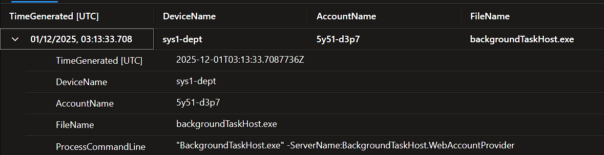

**KQL:**

```kql
DeviceProcessEvents
| where AccountName == "5y51-d3p7"
| project TimeGenerated, DeviceName, AccountName, FileName, ProcessCommandLine
| order by TimeGenerated asc
```


</details>

---

<details>
<summary><strong>Flag 2 – Interactive Remote Session Confirmation</strong></summary>

**Flag:** 192.168.0.110

**Summary:**
Remote interactive activity confirmed attacker presence and attribution of subsequent actions. 

**Evidence:**

* Remote session telemetry
* Correlated activity timeline

**Screenshot:**

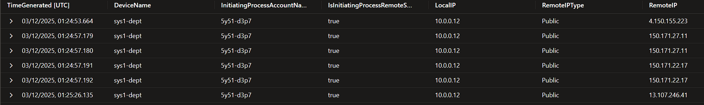

**KQL:**

```kql
let startTime = datetime(2025-12-01T03:00:00Z);
let endTime   = datetime(2025-12-03T09:00:00Z);
let compromisedUser = "5y51-d3p7";
let compromisedHost = "sys1-dept";
DeviceNetworkEvents
| where TimeGenerated >= startTime + 1d
| where TimeGenerated <= endTime
| where DeviceName == compromisedHost
| where InitiatingProcessAccountName == compromisedUser
| project TimeGenerated, DeviceName, InitiatingProcessAccountName,
          IsInitiatingProcessRemoteSession, LocalIP, RemoteIPType, RemoteIP
| order by TimeGenerated asc
```

Flag: `192.168.0.110` pivot from source IP `4.150.155.223`

</details>

---

<details>
<summary><strong>Flag 3 – PowerShell Execution with Policy Bypass</strong></summary>

**Flag:** "powershell.exe" -ExecutionPolicy Bypass -File C:\Users\5y51-D3p7\Downloads\PayrollSupportTool.ps1

**Summary:**
The attacker executed a PowerShell script using execution-policy bypass to deploy tooling.

**Evidence:**

* PowerShell command-line parameters
* Script execution path

**Screenshot:**

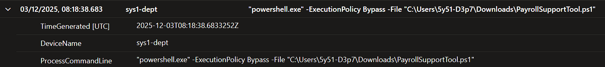


**KQL:**

```kql
let startTime = datetime(2025-12-01T03:00:00Z);
let endTime   = datetime(2025-12-03T09:00:00Z);
let compromisedAccount = "5y51-d3p7";
let initialHost = "sys1-dept";
DeviceProcessEvents
| where DeviceName == initialHost
| where AccountName == compromisedAccount
| where TimeGenerated between (startTime .. endTime)
| where ProcessCommandLine has "powershell"
| project TimeGenerated, DeviceName, ProcessCommandLine

```

</details>

---

<details>
<summary><strong>Flag 4 – Privilege & Context Enumeration</strong></summary>

**Flag:** "whoami.exe" /all

**Summary:**
The attacker enumerated account privileges to validate access level before proceeding.

**Evidence:**

* `whoami /all` execution

**Screenshot:**

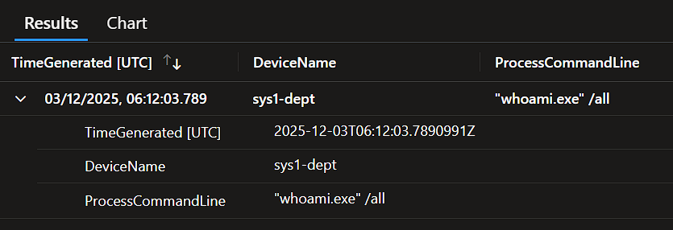

**KQL:**

```kql
let startTime = datetime(2025-12-01T03:00:00Z);
let endTime   = datetime(2025-12-03T09:00:00Z);
let compromisedAccount = "5y51-d3p7";
let initialHost = "sys1-dept";
DeviceProcessEvents
| where DeviceName == initialHost
| where AccountName == compromisedAccount
| where TimeGenerated between (startTime .. endTime)
| where ProcessCommandLine has_any ("whoami", "net user", "net group", "query user")
| project TimeGenerated, DeviceName, ProcessCommandLine
| order by TimeGenerated asc

```

</details>

---

<details>
<summary><strong>Flag 5 – Discovery of Bonus Matrix Files</strong></summary>

**Flag:** BonusMatrix_Draft_v3.xlsx

**Summary:**
Manual browsing of HR directories revealed draft bonus matrix files.

**Evidence:**

* Shortcut (.lnk) artifacts
* File access telemetry

**Screenshot:**

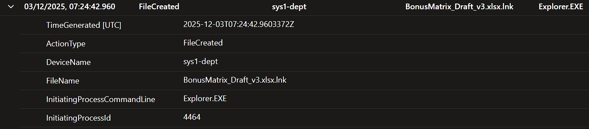

**KQL:**

```kql
let startTime = datetime(2025-12-01T03:00:00Z);
let endTime   = datetime(2025-12-03T09:00:00Z);
let compromisedAccount = "5y51-d3p7";
let initialHost = "sys1-dept";
DeviceFileEvents
| where DeviceName == initialHost
| where InitiatingProcessAccountName == compromisedAccount
| where TimeGenerated between (startTime .. endTime)
| project TimeGenerated, ActionType, DeviceName, FileName,
          InitiatingProcessCommandLine, InitiatingProcessId, InitiatingProcessUniqueId

```

</details>

---

<details>
<summary><strong>Flag 6 – Local Data Staging via Archive Creation</strong></summary>

**Flag:** 2533274790396713

**Summary:**
Sensitive files were compressed into an archive, confirming staging behavior.

**Evidence:**

* `export_stage.zip` creation

**Screenshot:**

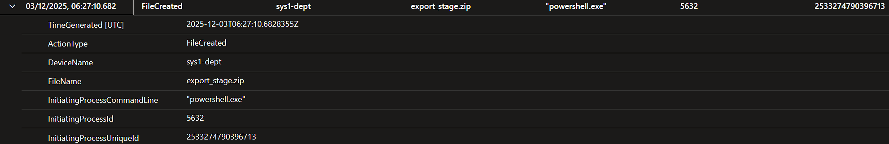

**KQL:**

```kql
let startTime = datetime(2025-12-01T03:00:00Z);
let endTime   = datetime(2025-12-03T09:00:00Z);
let compromisedAccount = "5y51-d3p7";
let initialHost = "sys1-dept";
DeviceFileEvents
| where DeviceName == initialHost
| where InitiatingProcessAccountName == compromisedAccount
| where TimeGenerated between (startTime .. endTime)
| where FileName endswith ".zip" or FileName endswith ".rar" or FileName endswith ".7z"
| project TimeGenerated, ActionType, DeviceName, FileName,
          InitiatingProcessCommandLine, InitiatingProcessId, InitiatingProcessUniqueId
```

</details>

---

<details>
<summary><strong>Flag 7 – Network Egress Testing</strong></summary>

**Flag:** 2025-12-03T06:27:31.1857946Z

**Summary:**
Outbound connectivity was tested immediately following staging.

**Evidence:**

* Connections to benign external services

**Screenshot:**

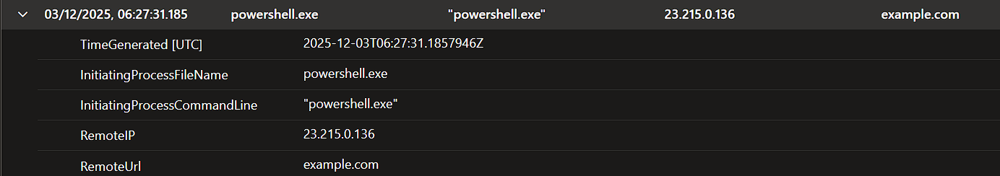

**KQL:**

```kql
let startTime = datetime(2025-12-01T03:00:00Z);
let endTime   = datetime(2025-12-03T09:00:00Z);
let compromisedAccount = "5y51-d3p7";
let initialHost = "sys1-dept";
DeviceNetworkEvents
| where DeviceName == initialHost
| where InitiatingProcessAccountName == compromisedAccount
| where TimeGenerated between (startTime .. endTime)
| where isnotempty(RemoteIPType)
| where isnotempty(RemoteUrl)
| project TimeGenerated, InitiatingProcessFileName,
          InitiatingProcessCommandLine, RemoteIP, RemoteUrl
| order by TimeGenerated asc
```

</details>

---

<details>
<summary><strong>Flag 8 – Registry Run Key Persistence</strong></summary>

**Flag:** HKEY_CURRENT_USER\S-1-5-21-805396643-3920266184-3816603331-500\SOFTWARE\Microsoft\Windows\CurrentVersion\Run

**Summary:**
A registry Run key was created to ensure persistence across reboots.

**Evidence:**

* Registry modification events

**Screenshot:**

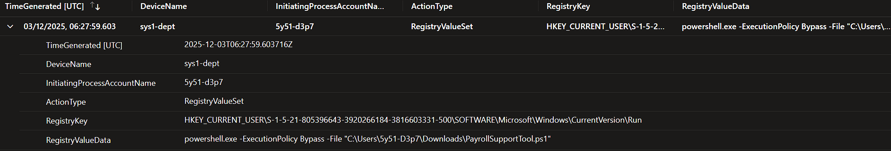

**KQL:**

```kql
let startTime = datetime(2025-12-01T03:00:00Z);
let endTime   = datetime(2025-12-03T09:00:00Z);
let compromisedAccount = "5y51-d3p7";
let initialHost = "sys1-dept";
DeviceRegistryEvents
| where TimeGenerated between (startTime .. endTime)
| where DeviceName == initialHost
| where InitiatingProcessAccountName == compromisedAccount
| where ActionType in ("RegistryValueSet", "RegistryKeyCreated")
| where RegistryKey has "Run"
| project TimeGenerated, DeviceName, InitiatingProcessAccountName,
          ActionType, RegistryKey, RegistryValueData

```

</details>

---

<details>
<summary><strong>Flag 9 – Scheduled Task Persistence</strong></summary>

**Flag:** BonusReviewAssist

**Summary:**
A scheduled task was created as a secondary persistence mechanism.

**Evidence:**

* Task creation telemetry

**Screenshot:**

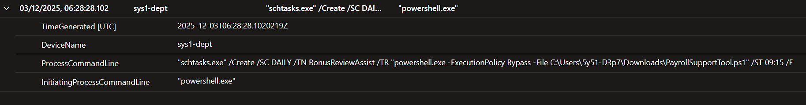

**KQL:**

```kql
let startTime = datetime(2025-12-01T03:00:00Z);
let endTime   = datetime(2025-12-03T09:00:00Z);
let compromisedAccount = "5y51-d3p7";
let initialHost = "sys1-dept";
DeviceProcessEvents
| where TimeGenerated between (startTime .. endTime)
| where DeviceName == initialHost
| where AccountName == compromisedAccount
| where ProcessCommandLine has "schtasks"
| project TimeGenerated, DeviceName, ProcessCommandLine,
          InitiatingProcessCommandLine

```

</details>

---

<details>
<summary><strong>Flag 10 – Lateral Movement to IT Helpdesk System</strong></summary>

**Flag:** YE-HELPDESKTECH

**Summary:**
The attacker pivoted to an IT helpdesk system to expand access.

**Evidence:**

* Remote access events

**Screenshot:**

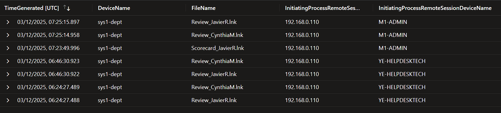

**KQL:**

```kql
let startTime = datetime(2025-12-01T03:00:00Z);
let endTime   = datetime(2025-12-03T09:00:00Z);
let initialHost = "sys1-dept";
DeviceFileEvents
| where TimeGenerated between (startTime .. endTime)
| where DeviceName == initialHost
| where IsInitiatingProcessRemoteSession == true
| where FileName has_any ("review", "scorecard", "employee", "performance")
| project TimeGenerated, DeviceName, FileName,
          InitiatingProcessRemoteSessionIP,
          InitiatingProcessRemoteSessionDeviceName

```

</details>

---

<details>
<summary><strong>Flag 11 – Access to HR Planning Workstation</strong></summary>

**Flag:** YE-HRPLANNER

**Summary:**
HR planning systems were accessed to locate higher-value datasets.

**Evidence:**

* HR workstation access events

**Screenshot:**

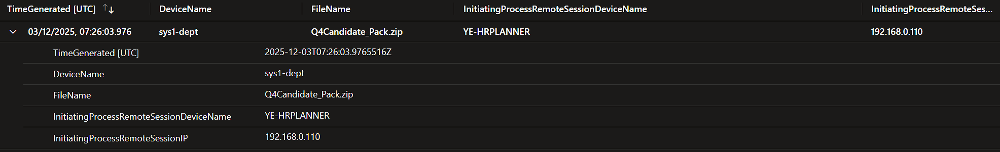

**KQL:**

```kql
let startTime = datetime(2025-12-01T03:00:00Z);
let endTime   = datetime(2025-12-03T09:00:00Z);
let initialHost = "sys1-dept";
DeviceFileEvents
| where TimeGenerated between (startTime .. endTime)
| where DeviceName == initialHost
| where IsInitiatingProcessRemoteSession == true
| where FileName == "Q4Candidate_Pack.zip"
| project TimeGenerated,
          DeviceName,
          FileName,
          InitiatingProcessRemoteSessionDeviceName,
          InitiatingProcessRemoteSessionIP
| order by TimeGenerated asc

```

</details>

---

<details>
<summary><strong>Flag 12 – Manual Review of Performance Data</strong></summary>

**Flag:** 2025-12-03T07:25:15.6288106Z

**Summary:**
Sensitive documents were manually reviewed using native tools.

**Evidence:**

* Notepad file access

**Screenshot:**

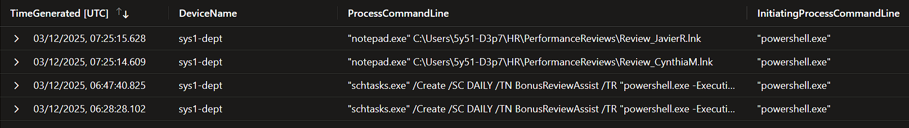

**KQL:**

```kql
let startTime = datetime(2025-12-01T03:00:00Z);
let endTime   = datetime(2025-12-03T09:00:00Z);
let compromisedAccount = "5y51-d3p7";
let initialHost = "sys1-dept";
DeviceProcessEvents
| where TimeGenerated between (startTime .. endTime)
| where DeviceName == initialHost
| where AccountName == compromisedAccount
| where ProcessCommandLine contains "review"
| project TimeGenerated, DeviceName, ProcessCommandLine,
          InitiatingProcessCommandLine

```

</details>

---

<details>
<summary><strong>Flag 13 – Access to Finalized Bonus Matrices</strong></summary>

**Flag:** 2025-12-03T07:25:39.1653621Z

**Summary:**
Final, sensitivity-labeled bonus matrices were accessed.

**Evidence:**

* Sensitive file read events

**Screenshot:**

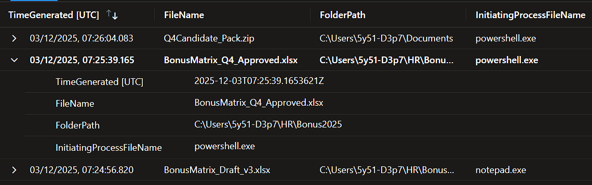

**KQL:**

```kql
let startTime = datetime(2025-12-01T03:00:00Z);
let endTime   = datetime(2025-12-03T09:00:00Z);
DeviceEvents
| where DeviceName == "sys1-dept"
| where TimeGenerated between (startTime .. endTime)
| where ActionType == "SensitiveFileRead"
| project TimeGenerated, FileName, FolderPath,
          InitiatingProcessFileName, AdditionalFields

```

</details>

---

<details>
<summary><strong>Flag 14 – Secondary Archive Creation</strong></summary>

**Flag:** C:\Users\5y51-D3p7\Documents\Q4Candidate_Pack.zip

**Summary:**
Additional archives were created, indicating structured data collection.

**Evidence:**

* `Q4Candidate_Pack.zip`

**Screenshot:**

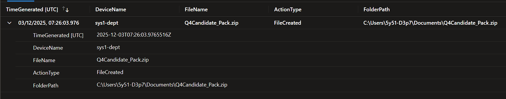

**KQL:**

```kql
let startTime = datetime(2025-12-01T03:00:00Z);
let endTime   = datetime(2025-12-04T09:00:00Z);
DeviceFileEvents
| where TimeGenerated between (startTime .. endTime)
| where FileName endswith ".zip"
| where FileName contains "candidate"
| where DeviceName == "sys1-dept"
| project TimeGenerated, DeviceName, FileName, ActionType, FolderPath

```

</details>

---

<details>
<summary><strong>Flag 15 – Additional Network Exfiltration Testing</strong></summary>

**Flag:** 2025-12-03T07:26:28.5959592Z

**Summary:**
Further outbound testing was performed to validate transfer capability.

**Evidence:**

* HTTP testing services accessed

**Screenshot:**

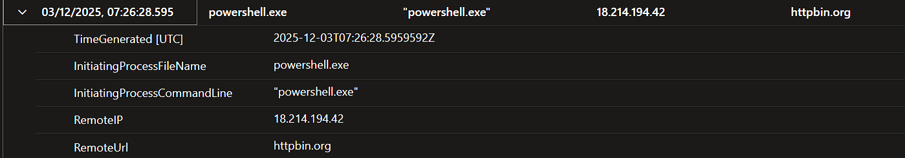

**KQL:**

```kql
let startTime = datetime(2025-12-01T03:00:00Z);
let endTime   = datetime(2025-12-03T09:00:00Z);
let compromisedAccount = "5y51-d3p7";
let initialHost = "sys1-dept";
DeviceNetworkEvents
| where DeviceName == initialHost
| where InitiatingProcessAccountName == compromisedAccount
| where TimeGenerated between (startTime .. endTime)
| where RemoteIPType == "Public"
| project TimeGenerated, InitiatingProcessFileName,
          InitiatingProcessCommandLine, RemoteIP, RemoteUrl
| order by TimeGenerated asc

```

</details>

---

<details>
<summary><strong>Flag 16 – Log Clearing (Anti-Forensics)</strong></summary>

**Flag:** "wevtutil.exe" cl Microsoft-Windows-PowerShell/Operational

**Summary:**
PowerShell operational logs were cleared to hinder forensic reconstruction.

**Evidence:**

* `wevtutil` log clear events

**Screenshot:**

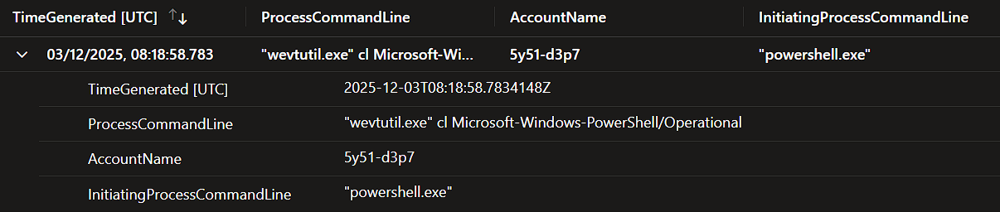

**KQL:**

```kql
let startTime = datetime(2025-12-01T03:00:00Z);
let endTime   = datetime(2025-12-03T09:00:00Z);
let initialHost = "sys1-dept";
DeviceProcessEvents
| where DeviceName == initialHost
| where TimeGenerated between (startTime .. endTime)
| where ProcessCommandLine has_any (
    "wevtutil",
    "Clear-EventLog",
    "clear-log",
    "cl Security",
    "cl Application",
    "cl System"
)
| project TimeGenerated, ProcessCommandLine,
          AccountName, InitiatingProcessCommandLine

```

</details>

---

<details>
<summary><strong>Flag 17 – Lateral Movement to Server Infrastructure</strong></summary>

**Flag:** main1-srvr

**Summary:**
The attacker accessed centralized server infrastructure, escalating impact.

**Evidence:**

* Server logon events

**Screenshot:**

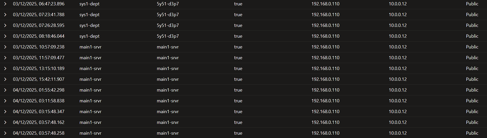

**KQL:**

```kql
let startTime = datetime(2025-12-01T03:00:00Z);
let endTime   = datetime(2025-12-04T09:00:00Z);
DeviceNetworkEvents
| where TimeGenerated between (startTime .. endTime)
| where IsInitiatingProcessRemoteSession == true
| where RemoteIPType == "Public"
| where InitiatingProcessRemoteSessionIP == "192.168.0.110"
| project TimeGenerated, DeviceName, InitiatingProcessAccountName,
          IsInitiatingProcessRemoteSession, InitiatingProcessRemoteSessionIP, LocalIP, RemoteIPType, RemoteIP
| order by TimeGenerated asc

```

</details>

---

<details>
<summary><strong>Flag 18 – Access to Centralized HR Archives</strong></summary>

**Flag:** 2025-12-04T03:11:58.6027696Z

**Summary:**
Centralized HR archive bundles were accessed on the server.

**Evidence:**

* Archive file access

**Screenshot:**

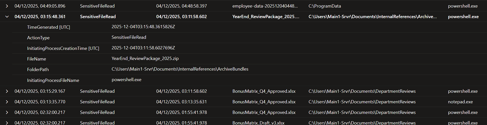

**KQL:**

```kql
let startTime = todatetime('2025-11-01');
let endTime   = todatetime('2025-12-10');
DeviceEvents
| where DeviceName == "main1-srvr"
| where TimeGenerated between (startTime .. endTime)
| where ActionType == "SensitiveFileRead"
| project TimeGenerated,
          ActionType,
          InitiatingProcessCreationTime,
          FileName,
          FolderPath,
          InitiatingProcessFileName,
          AdditionalFields

```

</details>

---

<details>
<summary><strong>Flag 19 – Employee Scorecard Access</strong></summary>

**Flag:** YE-FINANCEREVIE

**Summary:**
Finance-origin scorecards and review data were accessed.

**Evidence:**

* Finance data file access

**Screenshot:**

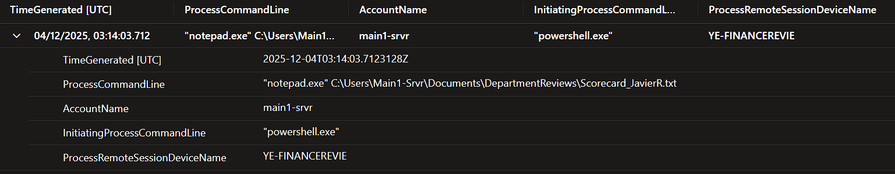

**KQL:**

```kql
let startTime = todatetime('2025-11-01');
let endTime   = todatetime('2025-12-10');
let initialHost = "main1-srvr";
DeviceProcessEvents
| where DeviceName == initialHost
| where TimeGenerated between (startTime .. endTime)
| where FileName =~ "notepad.exe"
| where ProcessCommandLine has "scorecard"
| project TimeGenerated,
          ProcessCommandLine,
          AccountName,
          InitiatingProcessCommandLine,
          ProcessRemoteSessionDeviceName
| order by TimeGenerated asc

```

</details>

---

<details>
<summary><strong>Flag 20 – Final Data Consolidation</strong></summary>

**Flag:** C:\Users\Main1-Srvr\Documents\InternalReferences\ArchiveBundles\YearEnd_ReviewPackage_2025.zip

**Summary:**
Multiple datasets were consolidated into final staging locations.

**Evidence:**

* Consolidated archive creation

**Screenshot:**

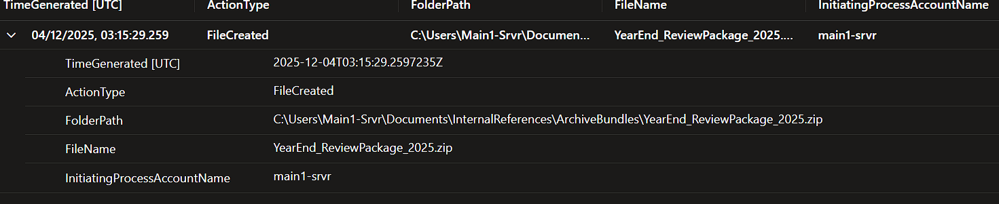

**KQL:**

```kql
let startTime = todatetime('2025-12-01');
let endTime   = todatetime('2025-12-05');
DeviceFileEvents
| where DeviceName == "main1-srvr"
| where TimeGenerated between (startTime .. endTime)
| where FileName endswith ".zip"
| where InitiatingProcessAccountName !in~ ("system", "local service", "network service")
| where InitiatingProcessAccountName !startswith "NT AUTHORITY"
| project TimeGenerated,
          ActionType,
          FolderPath,
          FileName,
          InitiatingProcessAccountName
| order by TimeGenerated asc
```

</details>

---

<details>
<summary><strong>Flag 21 – Server-Side Exfiltration Readiness</strong></summary>

**Flag:** 2025-12-04T03:15:29.2597235Z

**Summary:**
Outbound connectivity testing was repeated from the server context.

**Evidence:**

* Server-origin network connections

**Screenshot:**

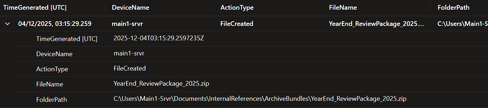

**KQL:**

```kql
let startTime = todatetime('2025-12-03');
let endTime   = todatetime('2025-12-05');
DeviceFileEvents
| where DeviceName == "main1-srvr"
| where TimeGenerated between (startTime .. endTime)
| where ActionType == "FileCreated"
| where FolderPath has @"InternalReferences\ArchiveBundles"
| project TimeGenerated, DeviceName, ActionType, FileName, FolderPath
| order by TimeGenerated asc

```

</details>

---

<details>
<summary><strong>Flag 22 – End-of-Operation Activity</strong></summary>

**Flag:** 54.83.21.156

**Summary:**
Final actions suggest readiness for bulk exfiltration or operation termination.

**Evidence:**

* No further interactive activity observed

**Screenshot:**

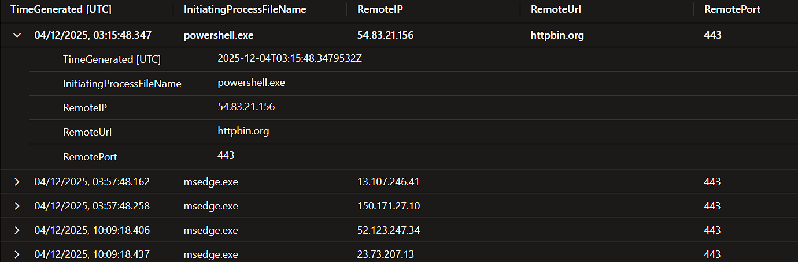

**KQL:**

```kql
let startTime = todatetime('2025-12-04T03:15:29Z');
let endTime   = todatetime('2025-12-05');
DeviceNetworkEvents
| where DeviceName == "main1-srvr"
| where TimeGenerated >= startTime
| where RemoteIPType == "Public"
| where InitiatingProcessAccountName !in~ ("system", "local service", "network service")
| where InitiatingProcessAccountName !startswith "NT AUTHORITY"
| project TimeGenerated,
          InitiatingProcessFileName,
          RemoteIP,
          RemoteUrl,
          RemotePort
| order by TimeGenerated asc

```

</details>

---

## 7. Detection Gaps Identified

* Valid account abuse during off-hours not alerted
* PowerShell execution with bypass flags unmonitored
* Sensitive file access lacked alerting
* Archive creation not scrutinized
* Log clearing not centrally protected
* Benign egress testing domains were not monitored


---

## 8. Defensive Recommendations

**Immediate**

* Reset compromised credentials
* Isolate affected hosts
* Remove persistence mechanisms

**Short-Term**

* Alert on PowerShell bypass execution
* Monitor archive creation in user directories
* Detect log clearing behavior

**Long-Term**

* Enforce least-privilege access
* Centralize and protect logging
* Develop behavioral detections for data theft

---

## 9. Final Assessment

This intrusion demonstrates a methodical, credential-driven data theft operation that bypassed traditional malware-focused defenses. Effective detection in such cases depends on behavioral analysis, cross-domain correlation, and proactive hunting rather than signature-based controls.

The combination of valid credential abuse, systematic lateral movement, sensitive data staging, and anti‑forensic behavior places this incident well above opportunistic malware activity and warrants treatment as a serious security breach with legal and regulatory implications.


---

## 10. Analyst Notes

This document is structured to support ongoing enrichment with screenshots, KQL queries, and detection logic. The case highlights how attackers can quietly achieve strategic objectives without exploiting a single vulnerability—by abusing trust, credentials, and routine administrative tooling. Effective detection in these scenarios depends on behavioral correlation, not signature‑based alerts.
